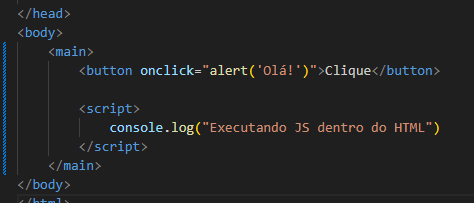
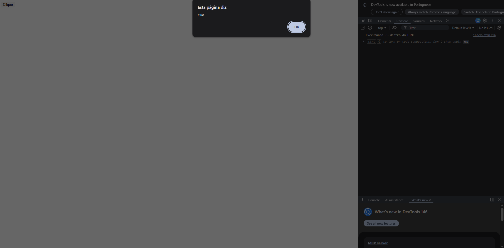

## ---- Introdução ----

JavaScript ou apenas JS, é uma linguagem leve fundamental para programação Front-End, estando presente em 98% dos sites da web. Isso se da por como o JS trabalha manipulando o HTML e CSS criando animações dinâmicas, validação de informações, entre outras utilidades. Porém, por ser uma linguagem muito versátil, pode ser utilizada também para Back-End e Full-Stack com o Node.js.

JavaScript trabalha junto com HTML e CSS para criação de websites adicionando comportamento e interatividade ao site. Em outras palavras, HTML é a estrutura, CSS é o estilo e JS seria a parte "funcional" do site, criando conteúdos dinâmicos, respondendo a ações do usuário (como cliques de botões), validando formulários e comunicando com servidores sem recarregar a página.

## ---- Formas de uso no HTML ----

Para utilizar o JS na criação de sites existem duas formas, dentro e fora do HTML. Para usar dentro do HTML, precisar estar dentro de uma tag <script> para funcionar, como no exemplo:

Ja para utilizar JS de fora, ou seja externo, precisará ser criado um arquivo .js na mesma pasta que o index.html, e no final da tag <body> precisa colocar

## ---- Variáveis, tipos e escopo ----

## ---- Operadores, comparações e lógica ----

A principal diferença é que == (igualdade solta) compara apenas os valores após converter os tipos (coerção), enquanto === (igualdade estrita) compara valor e tipo sem conversão. O === é mais seguro, pois  y  1 == '1' é true, mas 1 === '1' é false, evitando bugs por tipos difere

## ---- Estruturas condicionais ----

## ---- Estruturas de repetição ----

## ---- Funções ----

## ---- Manipulação de página com JavaScript ----
