## ---- Introdução ----

JavaScript ou apenas JS, é uma linguagem leve fundamental para programação Front-End, estando presente em 98% dos sites da web. Isso se da por como o JS trabalha manipulando o HTML e CSS criando animações dinâmicas, validação de informações, entre outras utilidades. Porém, por ser uma linguagem muito versátil, pode ser utilizada também para Back-End e Full-Stack com o Node.js.

JavaScript trabalha junto com HTML e CSS para criação de websites adicionando comportamento e interatividade ao site. Em outras palavras, HTML é a estrutura, CSS é o estilo e JS seria a parte "funcional" do site, criando conteúdos dinâmicos, respondendo a ações do usuário (como cliques de botões), validando formulários e comunicando com servidores sem recarregar a página.

## ---- Formas de uso no HTML ----

Para utilizar o JS na criação de sites existem duas formas, dentro e fora do HTML. Para usar dentro do HTML, precisar estar dentro de uma tag <script> para funcionar, como no exemplo:

Ja para utilizar JS de fora, ou seja externo, precisará ser criado um arquivo .js na mesma pasta que o index.html, e no final da tag <body> precisa colocar a tag <scrip src="nome_do_arquivo_js"> como no exemplo:
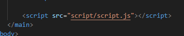 

Usar um arquivo .js externo é muito utilizado por ser muito mais organizado doque escrever um código inteiro dentro do HTML. Além de deixar muito mais fácil para manutenção e correção do código. Porém em alguns casos especifícos como testes rápidos ou códigos simples (como no primeiro exemplo). Mas em trabalhos maiores e complexos é muito recomendado utilizar um arquivo externo.

## ---- Variáveis, tipos e escopo ----

## ---- Operadores, comparações e lógica ----

Para comparação em JS é utilizado os operadores "==" e "===" para comparar elementos iguais.
 
A principal diferença é que == (igualdade solta) compara apenas os valores após converter os tipos (coerção), enquanto === (igualdade estrita) compara valor e tipo sem conversão. O === é mais seguro, pois  y  1 == '1' é true, mas 1 === '1' é false, evitando bugs por tipos diferentes.

Comparação com == :

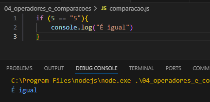

Comparação com === :
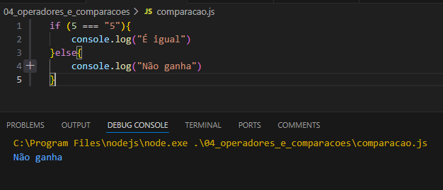

Para comparar elementos diferentes se usa os operadores "!=" e "!==".

A lógia segue a mesma dos dois primeiros operadores, "!=" é uma comparação mais "flexível", não comparando o tipo somente o valor. Já "!==" é mais estrito, comparando o tipo também.

Comparação com != :
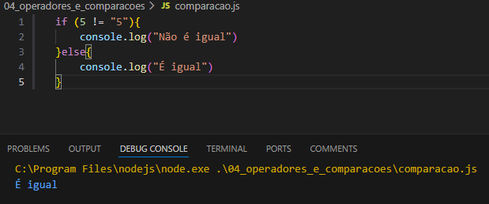

Comparação com !== :
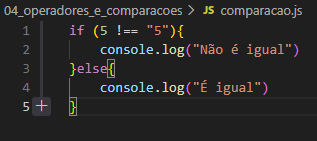

O operador "===" é muito mais seguro que "==", principalmente em situações de login e validação de senhas, pois como "==" converte os tipos automaticamente, podendo dar erro na validação.
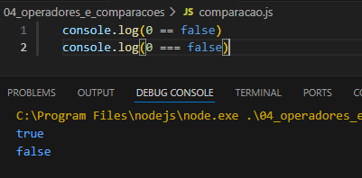

## ---- Estruturas condicionais ----

As estruturas de condição servem para tomar decisões no código, dependendo da condição usando "if", "if..else" "switch"

if = é usado quando somente uma condição é verdadeira.
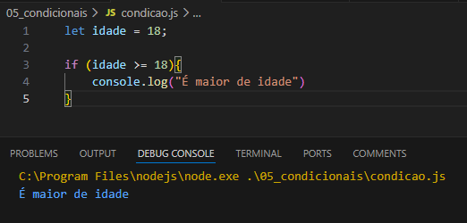

"if..else" = é usado em situações que se a condição for verdadeira o código realiza uma função e se for falsa o código realiza outra função.
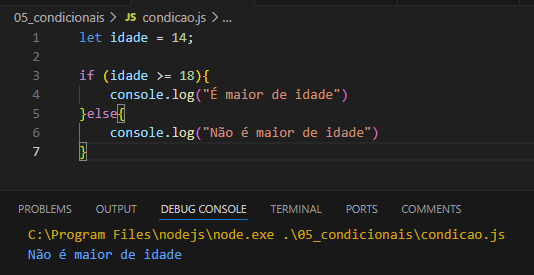

"switch" = é usado quando tem varias casos posiveis e precisa de uma condição para escolher um caso.
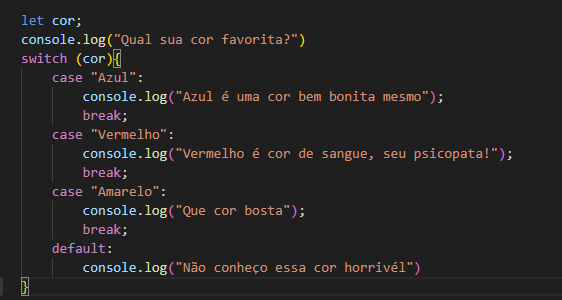

## ---- Estruturas de repetição ----

A estrutura de repetição serve para para executar um bloco de código várias vezes, evitando de repetir o mesmo código manualmente, usando as "for" e "while". 
"for"= é usado quando é definido quantas vezes tem que repetir.
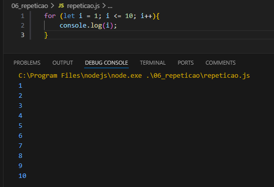

"while" = é usado em situações que estabelecem uma condição, que se repete enquanto ela for verdadeira.
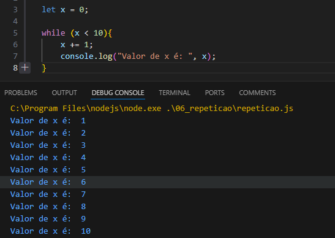

## ---- Funções ----

## ---- Manipulação de página com JavaScript ----

É um processo que transforma o html que é estático editavel em tempo real alterando itens da página sem que precise recarregar a página